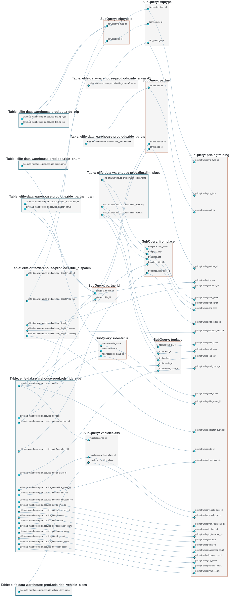
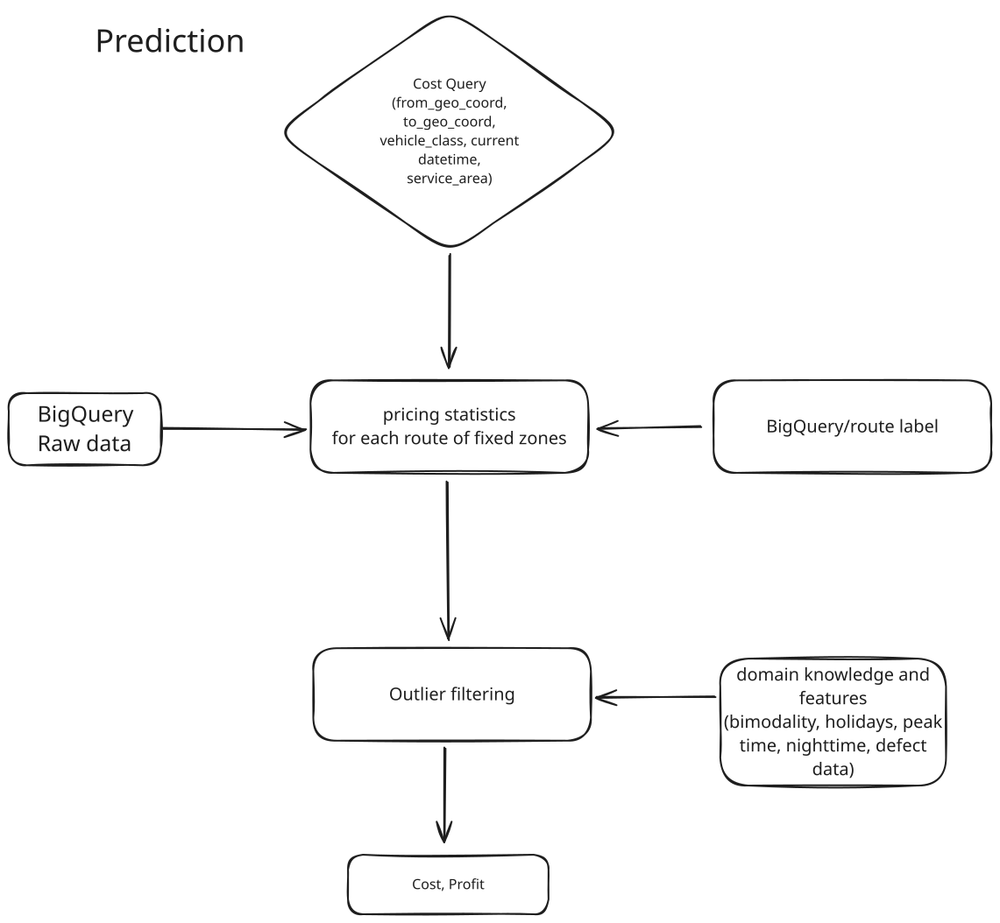
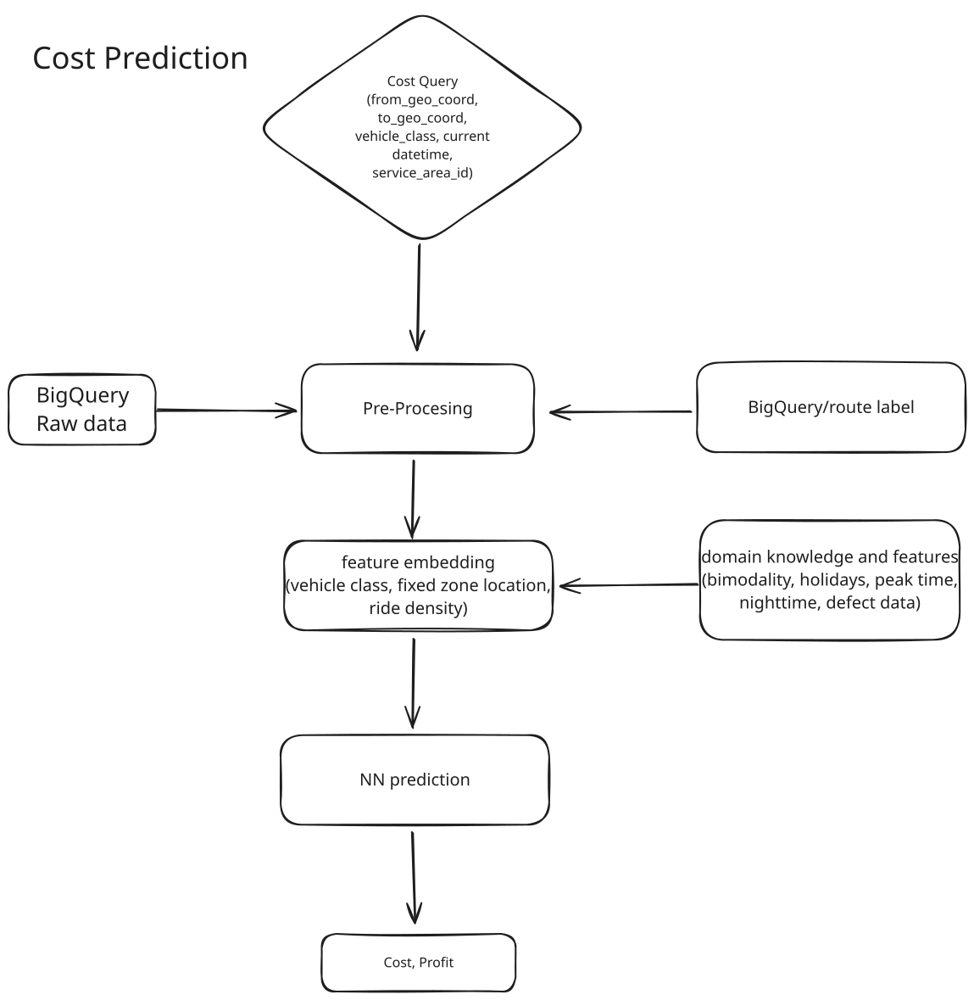

# pricing


<!-- WARNING: THIS FILE WAS AUTOGENERATED! DO NOT EDIT! -->

Price prediction and forecasting

## Install

1.  Clone the repo to local directory

2.  Install the package as editable

``` sh
pip install -e .
```

## How to use

1.  data.database.sqlalchemy
    - We extract raw production data (rides, dispatches, timestamps,
      time zones, actual history exchange rates etc.) from Google
      BigQuery and process and assemble them to get the tables we need
      for our pricing strategy.
    - It’d be fast with running sql query inside online BigQuery Studio
      and use Pycharm Database to connect to BQ database and either
      download the tables as csv or relocate them to local sqlite3
      storage file.
2.  data.utils
    - Local sqlite3 database or csv files are used as local caches for
      the tables extracted from Google BigQuery to accelerate the data
      processing.
    - utils contain tools for
      - checking rows with invalid time zones (daylight settings) and
        build a map to correct them
      - convert BigQuery data to sqlite3 database and csv file
      - checking and store rows with invalid timestamps in the raw table
        for manually fixing them later in SqlStudio
3.  data.database.deduplication
    - We collect the geographic coordinates with reduced precision to
      create the minimal location set for the required starting and
      ending locations.
    - We look them up with Route Query API (Ping) to get the fixed price
      zone labels for the minimal start/end location sets. (This takes a
      night when the minimal location set has 300k samples with 24 local
      threads)
    - We then take the union of start and end to get a single table with
      the minimal location set for labeling all the rows in the raw
      dataset.
4.  data.database.processing.label
    - We label the cleansed valid raw dataset (ca. 2 Mio) with the
      minimal location set by joining both with the same reduced
      precision coordinates.
5.  data.database.processing.holidays
    - In order to get cost prediction, it’s critical to filter out
      irregular prices on weekends, peak time and in particular
      holidays. We use service area string fixed in data.utils to
      extract country and state code and then get the local holidays
      from holidays package.
    - check and store rows with invalid service area in the raw table
      for manually fixing them later in SqlStudio
6.  data.database.processing.sql3
    - We then get the cost and profit from the labeled dataset by the
      dataframe by selecting the rows with the input route start/end,
      service area id, and vehicle class id. We get exclude the rows
      with irregular prices due to weekends, peak time, nighttime and
      holidays. We calculate the cost and profit from complete ride
      information.
    - if no rides are available for regular cost after excluding the
      irregular prices. We return the irregular prices with a flag. If
      even the irregular prices are not available since no valid ride
      data exist, we return None (null).
    - There are some EDA like exploring the cost and profit distribution
      for the fixed price zones, vehicle classes, dispatch counts
      sorting and plotting distributions of the counts according to the
      fixed price zones.
7.  data.database.filtering
    - We use openstreetmap API and mapbox visualization to have verified
      that the distance and duration are estimated by navigation engine.
      In particular, the distance are not the geographic distance in
      straight lines.

### Sql processing for rides and dispatches data extraction from Google BigQuery

We use SqlAlchemy.Core to interact with the sqlite3 and Google Bigquery
database. SqlAlchemy.Core is a SQL toolkit and Object-Relational Mapping
(ORM) library for Python. It provides a full suite of well-known
enterprise-level persistence patterns, designed for efficient and
high-performing database access, adapted into a simple and Pythonic
domain language.

1.  01.data.database.sqlalchemy.ipynb

### Some Utilities for rides and dispatches data extraction from Google BigQuery

1.  time zone processing to fix the time zone strings in the raw data
2.  convert csv files to sqlite3 database tables with data cleansing,
    deduplication, and data type conversion
3.  precision reduction for longitude and latitude data from raw data
    for reducing the geographic coordinates needed to get the route
    labels to save calls to the Route API(ping’s)

### 

# Processing flowchart

## Data lineage

The flollowing diagram shows the data lineage of the raw data from the
Google BigQuery data for cost price prediction and the data processing
steps to get the labeled dataset for the cost prediction model.



## Cost and profit prediction with Ground Truth data from historical rides

The following diagram depicts the cost & profit prediction based on the
historical rides data given the fixed price zones, vehicle classes.

- We use the fixed price zones, vehicle classes, and the historical
  rides data to predict the cost and profit for the rides.
- Historical rides data are extracted from raw data with the same route
  start/end labels, service area id, and vehicle class id.
- We filter out the irregular prices due to weekends, peak time,
  nighttime and holidays.
- We calculate the cost and profit from the complete ride information as
  the mean value of all the historical dispatch costs. The profit is the
  difference of the platform dispatch cost and elife dispatch cost
  corresponding to the dispatch with the mean value.



## Cost and profit prediction with a time series model (TODO)

The following diagram depicts the cost & profit prediction based on the
time series model given the fixed price zones, vehicle classes. The
training dataset is the same historical dataset used in the former
statistical method. Each routes and vehicle classes are treated as a
single time series model with the cost and profit as the target
variable.



# Outlook

## Use Exogeneous variables for time series price prediction

Exogeneous variables consume information like vehicle class, holidays,
events, weekdays, route distance, duration and other add-on infos and
can be used to turn all dispatch/ride data into time series samples into
generic samples for a holistic price prediction neural network model.
This way we can treat almost all the dispatches with different vehicle
classes and fixed price zones as generic time series samples and predict
the cost and profit for the rides with a single big model, thus
generalize the model for all the dispatches. But it’s a challenge to get
the exogeneous variables for the rides and dispatches in the real world
and the cost is increasing model size, complexity and training
resources.

For example we can use
[Autogluon](https://auto.gluon.ai/dev/tutorials/timeseries/forecasting-indepth.html)
or [Nixtla
neuralforecast](https://nixtlaverse.nixtla.io/statsforecast/docs/how-to-guides/exogenous.html),
[Meta
NeuralProphet](https://neuralprophet.com/tutorials/tutorial05.html?highlight=exogenous)
to predict the cost and profit for the rides with the exogeneous
variables. Autogluon is a AutoML toolkit for deep learning models with a
focus on time series prediction.

## Use GNN for better fixed price zones

We can use Graph Neural Networks to cluster route destinations as the
fixed price zones instead of heuristic manual clustering by human
annotator by leveraging the graph structure of the road network and
better route properties like predicted route distance by navigation
engine. The high density of the destination with navigation engine
distance reveals the downtown area with high demand and the fixed price
zones can be better clustered by the GNN model.

## Knowlege Graph for Fixed-Price-Zones, vehicle classes, and other entities

We can use Knowledge Graph to store the entities and their relations to
have a better understanding of the fixed price zones, vehicle classes,
and other entities. It’s very usefule then to build intelligent queries
wrapping around the knowledge graph to disclose the insights of the
entities and their relations.
